# E-HealthCare-Management-System
<h2>Table Of Content</h2>
<ol>
  <li><a href="#description">Description</a></li>
  <li><a href="#lat">Languages and Technology Used</a></li>
  <li><a href="#Req">Requirements</li>
  <li><a href="#features">Features</a></li>
  <li><a href="#steps">Steps to run the project in your machine</a></li>
  <li ><a href="#ws">Working-Snippets</a></li>
  <li><a href="#cs"> Database-Snippets</a></li>

</ol>
<h2 id="description">Description</h2>
 E-HealthCare-Management-System is a console based application which is built using java.This application helps in management of  Patients, doctors, admin in a easy and comfortable way.using this Application patients can quickly Sign up, Login, view his/her profile, view doctors, book Appointment, view Report, choose doctor, view Appointments, give feedback, pay online and logout. Admin can add Doctors,view patients list, view Doctors list,remove doctors, see feedback given by patients,view reports,logout.Doctor can login, view profile, viewAppointments, Attend Patients and logout. 
 
 <h2 id="lat">Languages and Technology Used</h2>
 <ul>
  <li>Java</li>
  <li>MySql</li>
  <li>Jdbc</li>
</ul>
<h2 id="Req">Requirements</h2>
<ul>
  <li>Java [JDK 8+]</li>
  <li>Eclipse</li>
  <li>MySql</li>
  <li>Jdbc Driver</li>
  <li>MySql Connector</li>
</ul>
 <h2 id="features">Features</h2>
 <ul>
  <li><a href="#login">login</a></li>
  <li><a href="#Admin">Admin’s DashBoard</a></li>
  <li><a href="#Patient">Patient’s DashBoard</a></li>
  <li><a href="#Doctor">Doctor’s DashBoard</a></li>
  <li><a href="#Report">Report-Table</a></li>
  <li><a href="#Appointment">Appointment-Table</a></li>
  <li><a href="#feedback">Feedback Form</a></li>
  <li><a href="#Booking">Booking Appointment</li>
  <li ><a href="#choose">Choosing Doctor</a></li>
  <li ><a href="#Payment">Payment Process</a></li>
 </ul>
 <h2 id="steps">Steps to run the project in your machine</h2>
 <ol>
   <li>Download and install Eclipse in your machine</li>
    <li>Clone or download the repository</li>
    <li>Extract all the files and move it in your eclipse directory.Open EHMS Folder.</li>
   <li>Open EHMS.sql in your MySql workbench.download MySql connector(“mysql-connector-java-8.0.22.jar" ) </li>
   <li>Now Open .classpath file in EHMS folder,in Line - 9 of This file Change the  path with the path where your .jar file is being downloaded. </li>
   <li>Open ConnectionProvider.java file and change the uname(username) and pass(password) variable according the user name and password of your MySql database</li>
   <li>Now it is ready to Run</li>
 </ol>
 <h2 id="ws">Working-Snippets</h2>
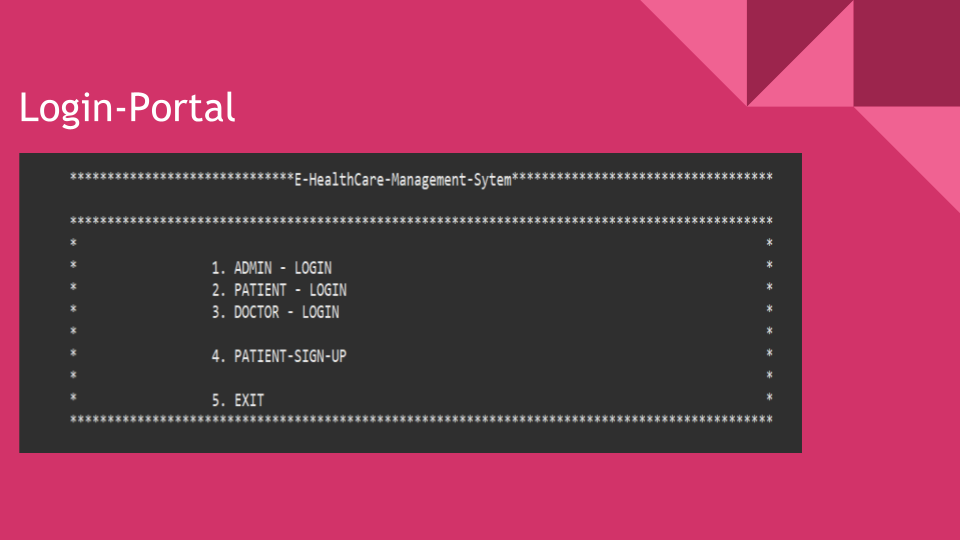
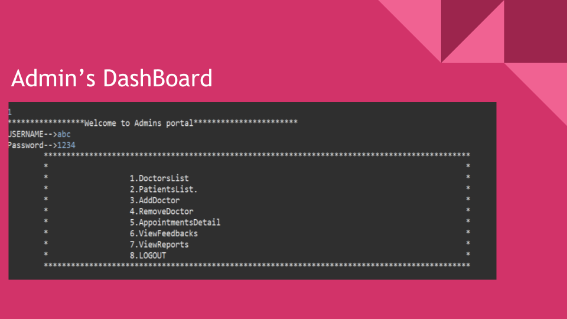
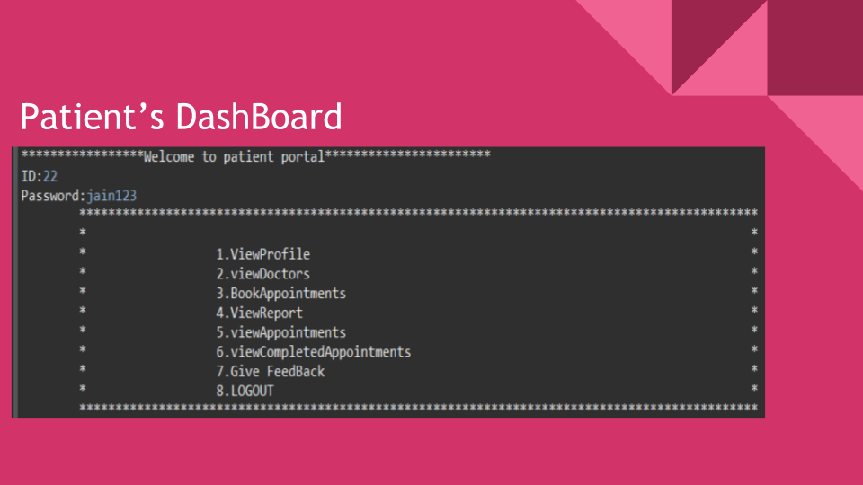
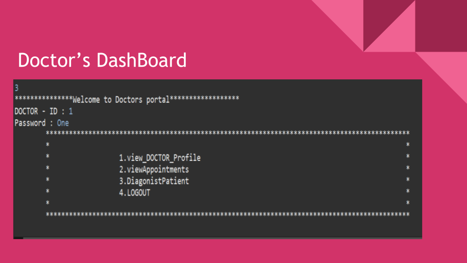
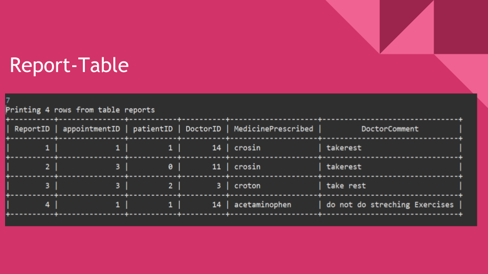
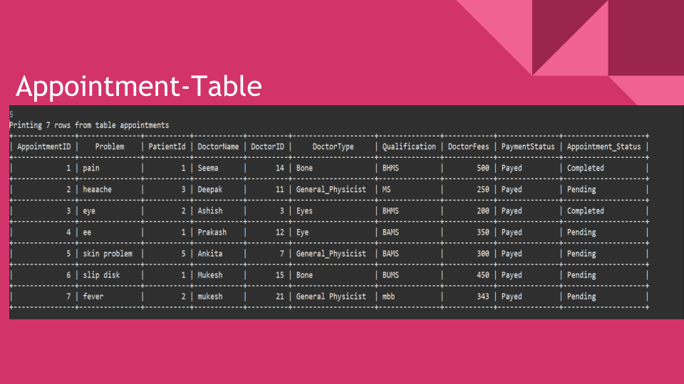
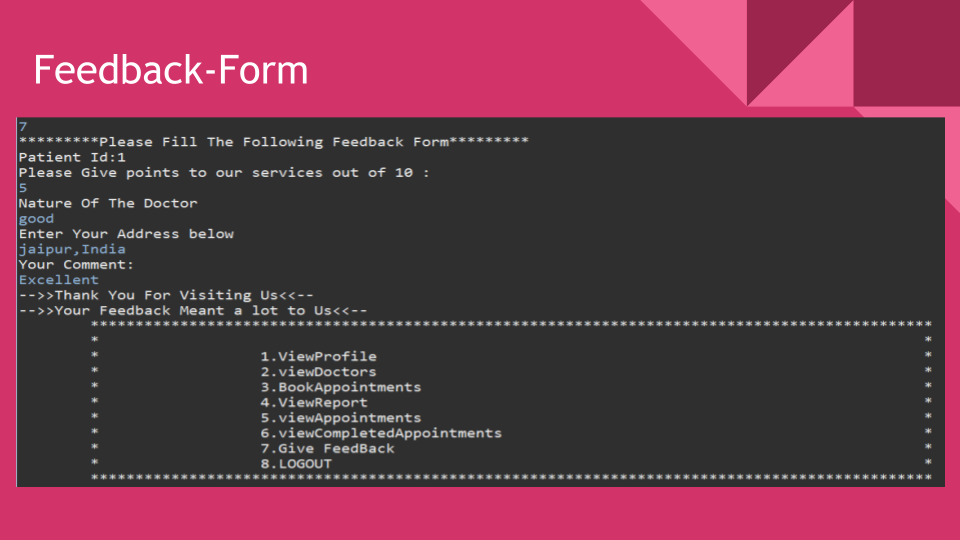
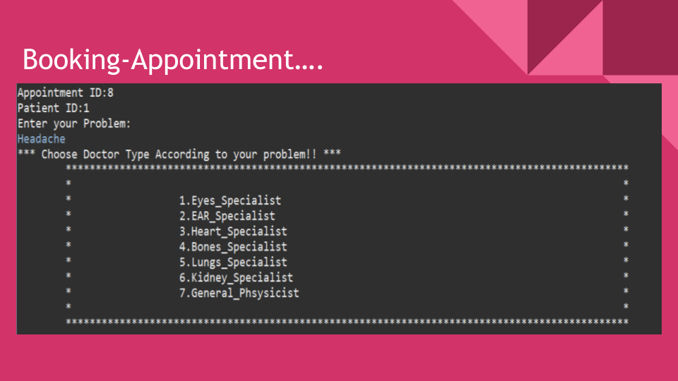
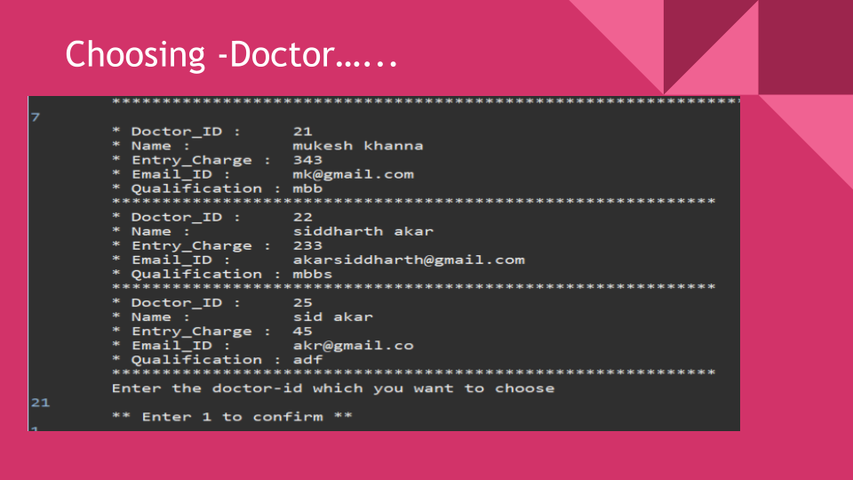
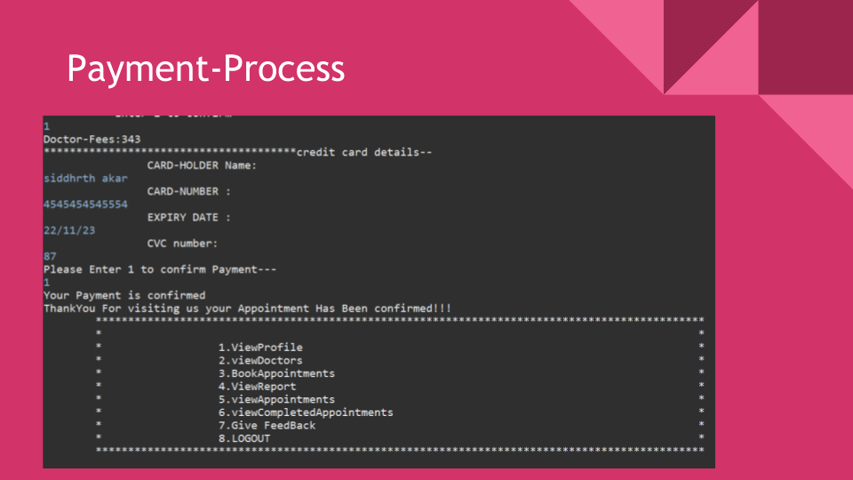
<h2 id="cs">Database-Snippets</h2>
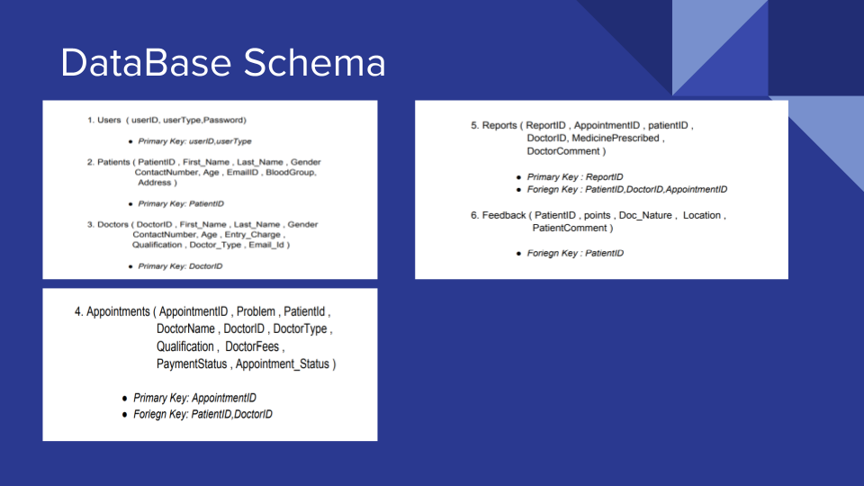
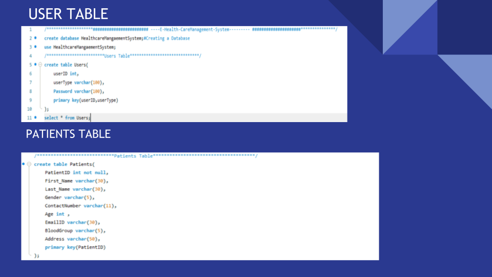
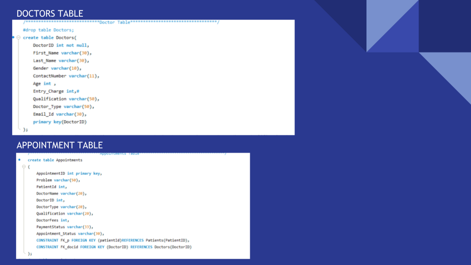
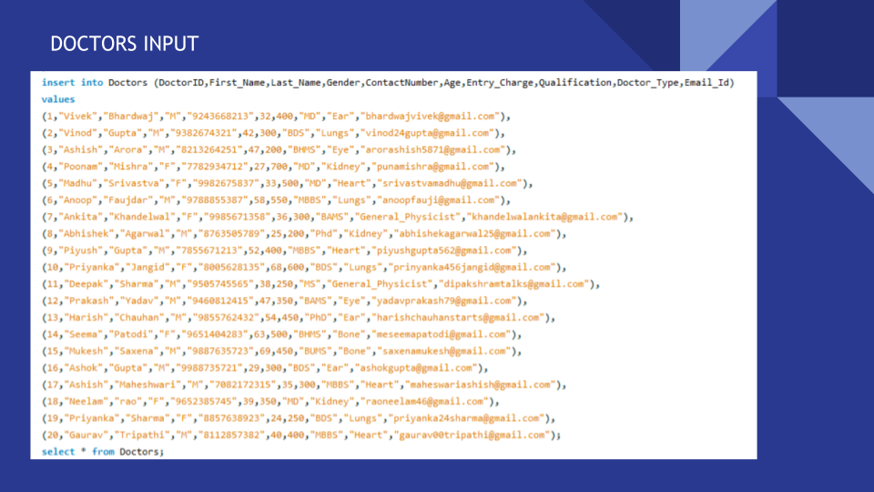
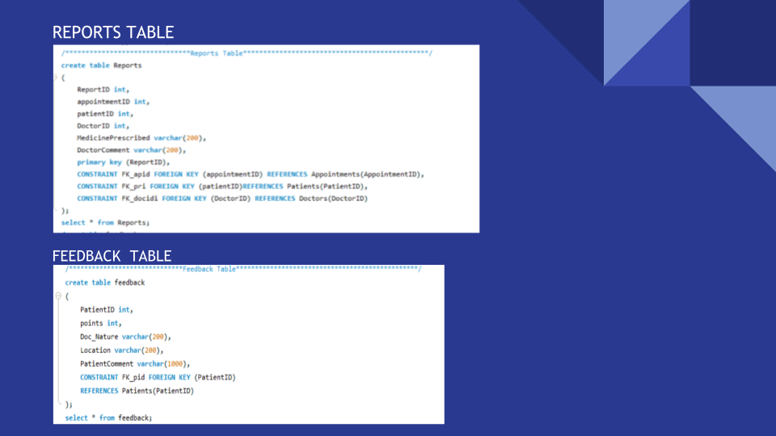
